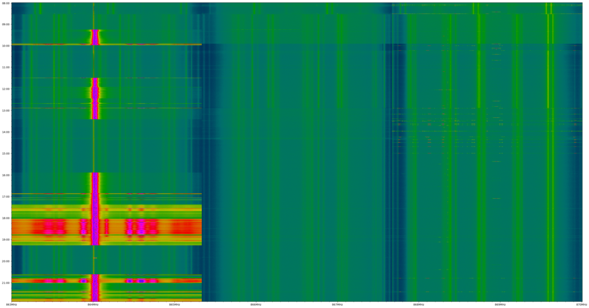
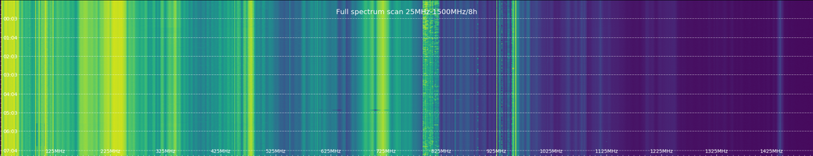
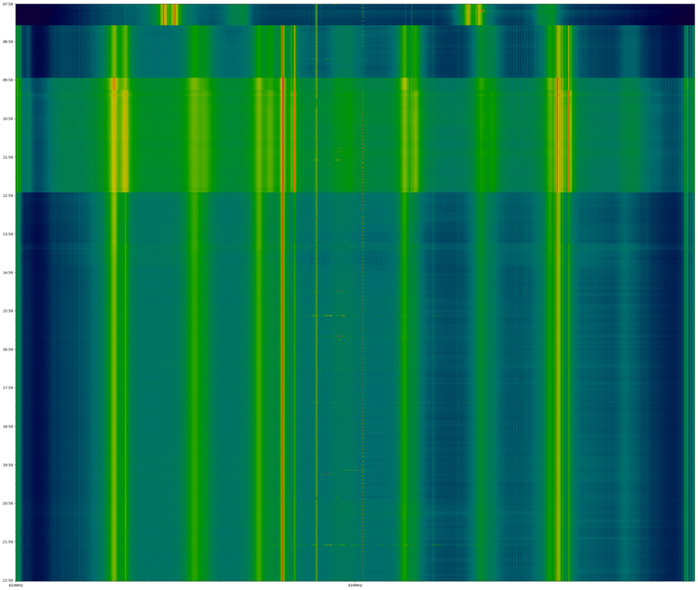
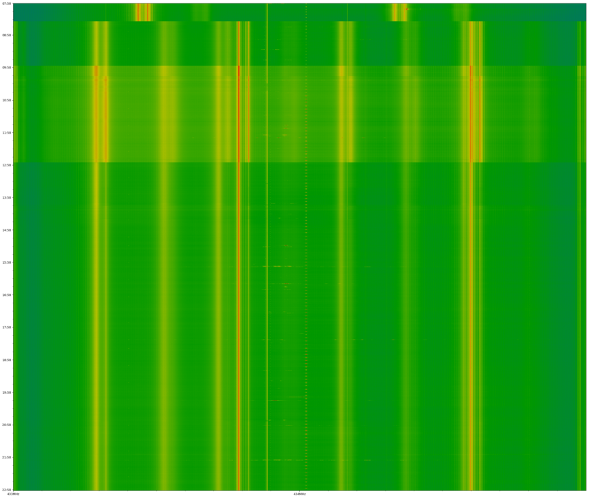
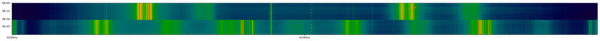

# rtl_heatmap
Yet another heatmap generator for *rtl_power* **csv** file

Instead of reinventing the wheel again, let's use *matplotlib* graphic capability to plot
the data gathered by rtl_power. All *matplotlib* colormaps are available and also the infamous 'charolastra' one (twilight+ colormaps only in matplotlib 3.x and above).

    $ ./rtl_heatmap.py -h
    usage: rtl_heatmap.py [-h] [--dbmin DBMIN] [--dbmax DBMAX] [-c COLORMAP]
                          [-f FORMAT] [-i INPUT] [--inside] [--force]
                          [--no-margin] [-o OUTPUT] [-q] [-s] [--start START]
                          [--end END] [--sort] [--title TITLE] [--yticks YTICKS]
                          [--xlines] [--ylines]

    Yet another heatmap generator for rtl_power .csv file

    optional arguments:
      -h, --help            show this help message and exit
      --dbmin DBMIN         Minimum value to consider for colormap normalization
      --dbmax DBMAX         Maximum value to consider for colormap normalization
      -c COLORMAP, --colormap COLORMAP
                            Specify the colormap to use (use "list" to get a list of
                            available colormaps)
      -f FORMAT, --format FORMAT
                            Format of the output image file
      -i INPUT, --input INPUT
                            Input csv filename
      --inside              Draw tick label inside plot
      --force               Force overwrite of existing output file
      --no-margin           Don't draw any margin around the plot
      -o OUTPUT, --output OUTPUT
                            Explicit name for the output file
      -q, --quiet           no verbose output
      -s, --show            Show pyplot window instead of outputting an image
      --start START         Start time to use; everything before that is ignored;
                            expected format YYY-mm-ddTHH[:MM[:SS]]
      --end END             End time to use; everything after that is ignored;
                            expected format YYY-mm-ddTHH[:MM[:SS]]
      --sort                Sort csv file data
      --title TITLE         Add a title to the plot
      --yticks YTICKS       Define tick in the time axis, xxx[h|m]
      --xlines              Show lines matching major xtick labels
      --ylines              Show lines matching major ytick labels

# Examples
Example of a generated heatmap, using defaults, 863MHz to 870MHz for a day:

## No margin
Using `-c viridis --no-margin --inside --ylines --yticks 1h --title "Full spectrum scan 25MHz-1500MHz/8h"`

## Normalization
If you expect the same color scale for different data set, you need to specify a normalization range by using --dbmin and --dbmax.

Here, the data set has value from -27.81dB to -3.23dB.
- With no normalization, the colormap auto-adjust to the data set range.
- With normalization, you specify the full range that the colormap should span, even the value not present in the data set.

## Truncation
You can "truncate" your data set by using `--start/--end` to specify the start and/or the end time to be used.

You can also use `--dbmin/--dbmax` switches to "truncate" the data set for values outside a given range.
For example, if the values span -27.81dB to -3.23dB and you specify `--dbmin -20` and `--dbmax -3` then values lesser than -20 will be plotted as the min value i.e. -20 and values greate than -3 will be plotted as the max value i.e -3.

|No normalization|Normalization by specifying `--dbmin -40 --dbmax 5`|
|---|---|
|||

|Truncated data set from 08:00 to 09:00|Truncation specified with `--dbmin -20 --dbmax -3`|
|---|---|
|||
